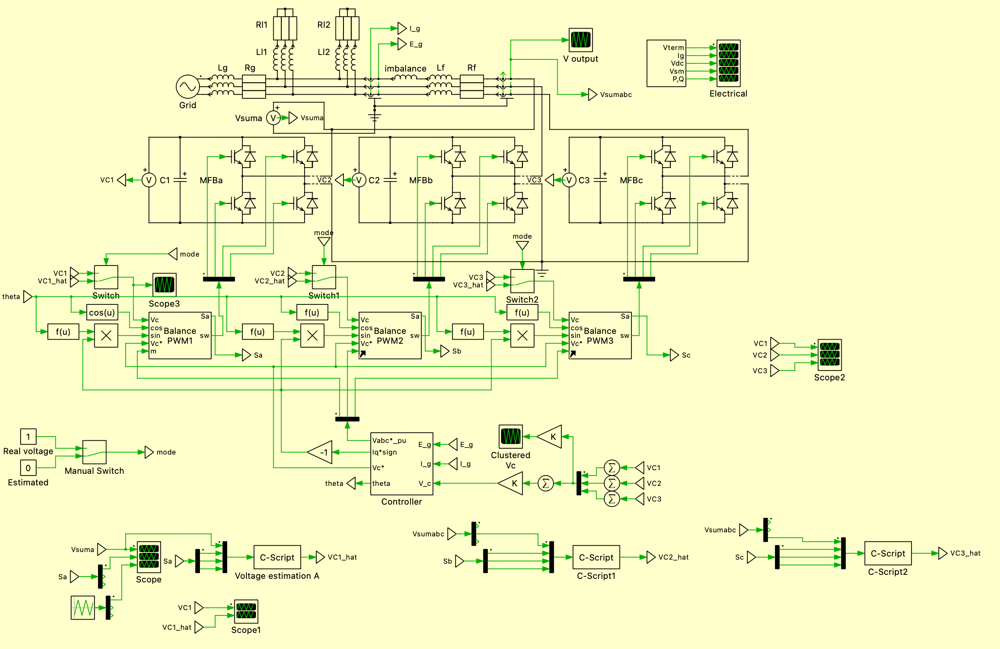
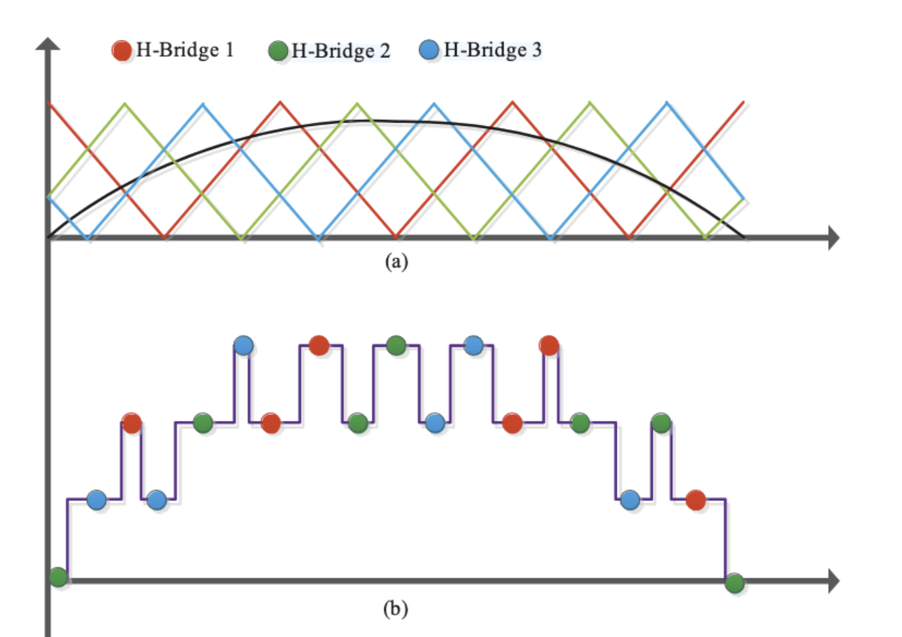
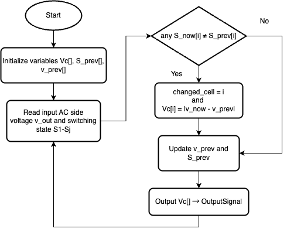

# Sensorless-Control-of-Cascaded-H-Bridge-Inverter-in-STATCOM

## System Introduction

This project Implement a sensorless control method mentioned in [A DC-Side Sensorless Cascaded H-Bridge Multilevel Converter-Based Photovoltaic System](https://ieeexplore.ieee.org/document/7437452) to realize a three phase Cascaded H-Bridges (CHB) inverter in STATOM system.



The simulation is adapted from the demo model of [PLECS STATCOM Cascaded H-Bridge Converter](https://www.plexim.com/sites/default/files/demo_models_categorized/plecs/statcom_cascaded_h_bridge_converter.pdf).

## Pre-requirment

The simulation is based on the software [PLECS](https://www.plexim.com/download/standalone).

## Sensorless Control Method



For a signle CHB module, its output can be expressed as:
$$
    v_{c - j} = S_j V_{c - j}
$$
where $v_{c - j}$ is the output voltage of the submodule $j$, $S_j$ is the switching state of the submodule $j$, $V_{c - j}$ is the capacitor voltage of the submodule $j$. In unipolar modulation, the switching state $S_j$ have values of $0$, $1$ and $-1$, and in bipolar modulation, the switching state $S_j$ have values of $0$ and $1$.
The estimated capacitor voltage is given by:
$$
 V_{c - j} = \left| v' - v'' \right|
$$
where$v'$ and $v''$ are the measurd AC output voltage befor and after the switching transition. When the switching state of a submodule is detercted, the capacitor voltage of the submodule can be refreshed by the formula above, and when the switching state do not change, the votage keeps same as the state before.  The flow chart is shown below:



## C-script code

```c++
#include <math.h>
#define N_CELL   3
double u[4]; //Inputs : u[0] = v_out , u[1..3] = S1,S2,S3  (int8_t 0|1)
double y[3]; //Output: y[0..2] = Vc1_hat , Vc2_hat , Vc3_hat
double Vc[3]; //Capacitor voltage
//last state
int S_prev[3] = {0,0,0};
double Vc[3] = {5000,5000,5000};
double v_prev = 0;
//present state
double v_now ;
int  S_now[N_CELL];
int i, changed_cell = -1;

u[0] = InputSignal(0,0);
u[1] = InputSignal(0,1);
u[2] = InputSignal(0,2);
u[3] = InputSignal(0,3);

    /* 复制当前开关状态 */
v_now=u[0];
for(i=0;i<N_CELL;i++){
    S_now[i] =u[i+1];
    if((S_now[i]!=S_prev[i])) changed_cell = i;   /* 记录发生跳变的 cell */
}

if(changed_cell >= 0){
        /* 计算输出电压跳变量 */
    double delta_v = fabs(v_now - v_prev);
  
    if(delta_v>4000&&delta_v<13000) Vc[changed_cell] = delta_v/2;}         /* ±Vc */
for(i=0;i<N_CELL;i++) S_prev[i] = S_now[i];
v_prev = v_now;
/* 输出 */
for(i=0;i<N_CELL;i++) y[i] = Vc[i];
OutputSignal(0,0)=y[0];
OutputSignal(0,1)=y[1];
OutputSignal(0,2)=y[2];
```

